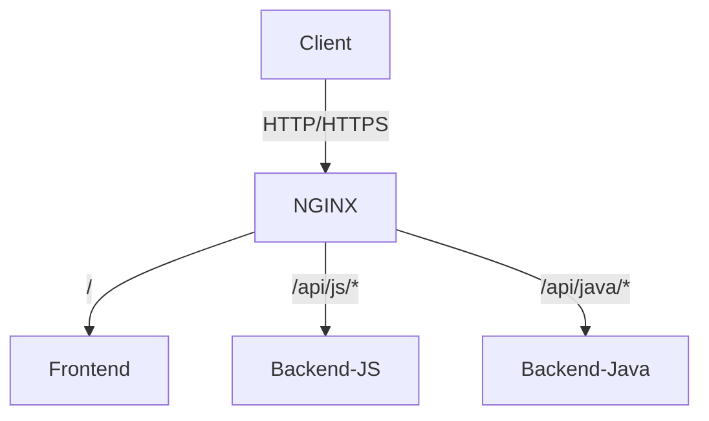

# MXC Project - Docker Setup

This document provides comprehensive documentation for setting up and running the MXC project using Docker.

## Table of Contents

- [Architecture Overview](#architecture-overview)
- [Prerequisites](#prerequisites)
- [Project Structure](#project-structure)
- [Getting Started](#getting-started)
  - [Development Environment](#development-environment)
  - [Production Deployment](#production-deployment)
- [Services](#services)
  - [NGINX Reverse Proxy](#nginx-reverse-proxy)
  - [Frontend](#frontend)
  - [Backend (JavaScript)](#backend-javascript)
  - [Backend (Java)](#backend-java)
- [Environment Variables](#environment-variables)
- [Volumes](#volumes)
- [Networking](#networking)
- [Common Operations](#common-operations)

## Architecture Overview

The MXC project consists of multiple services running in Docker containers:

- **NGINX**: Reverse proxy that routes requests to the appropriate service
- **Frontend**: Angular application
- **Backend (JavaScript)**: Node.js/Express server
- **Backend (Java)**: Spring Boot application



## Prerequisites

- Docker 20.10.0+
- Docker Compose 2.0.0+
- Git
- Node.js 18+ (for development)
- Java 17+ (for Java backend development)

## Project Structure

```
mxc/
├── docker/
│   ├── nginx/
│   │   ├── Dockerfile
│   ├── frontend/
│   │   └── nginx.conf
│   ├── backend-js/
│   │   └── Dockerfile
│   └── backend-java/
│       └── Dockerfile
├── frontend/           # Application Angular
├── backend-js/         # API Node.js/Express
├── backend-java/       # API Java Spring Boot
├── docker-compose.yml
├── .env.example
└── README-DOCKER.md
```

## Services

### Frontend

- **Framework** : Angular
- **Port** : 4200 (développement)
- **Variables d'environnement** :
  - `NODE_ENV` : Environnement (development/production)
  - `API_URL` : URL de base pour les requêtes API (par défaut: http://localhost:3000)

### Backend (JavaScript ou Java)

#### Option 1: Backend JavaScript (par défaut)
- **Framework** : Node.js/Express
- **Port** : 3000
- **Variables d'environnement** :
  - `NODE_ENV` : Environnement (development/production)
  - `PORT` : Port d'écoute (par défaut: 3000)
  - `CONTENT_DIR` : Chemin vers le répertoire de contenu

#### Option 2: Backend Java (alternative)
- **Framework** : Spring Boot
- **Port** : 3000
- **Variables d'environnement** :
  - `SPRING_PROFILES_ACTIVE` : Profils actifs (dev/prod)
  - `SERVER_PORT` : Port d'écoute (par défaut: 3000)

## Variables d'Environnement

Créez un fichier `.env` à la racine du projet en vous basant sur `.env.example` :

```
# Général
NODE_ENV=development

# Frontend
API_URL=http://localhost:3000

# Backend (JavaScript)
PORT=3000
CONTENT_DIR=/app/data/content

# Backend (Java)
SPRING_PROFILES_ACTIVE=dev
SERVER_PORT=3000
```

## Volumes

- `mxc_data` : Contient les données de l'application
- `mxc_logs` : Contient les journaux d'application

## Réseau

- `mxc_network` : Réseau interne pour la communication entre conteneurs

## Utilisation

### Développement

1. Copiez `.env.example` vers `.env` et ajustez les valeurs si nécessaire
2. Démarrez l'environnement de développement :
   ```bash
   docker-compose up
   ```
   Cela démarrera les services en mode développement avec rechargement automatique.

### Production

1. Définissez `NODE_ENV=production` dans votre fichier `.env`
2. Construisez et démarrez l'environnement de production :
   ```bash
   docker-compose -f docker-compose.yml up -d --build
   ```

### Changer de Backend

Pour basculer entre les backends JavaScript et Java :

1. Arrêtez les services actuels :
   ```bash
   docker-compose down
   ```

2. Modifiez le fichier `docker-compose.yml` pour commenter/décommenter la section appropriée dans la configuration du service `backend`

3. Redémarrez les services :
   ```bash
   docker-compose up -d
   ```

## Maintenance

### Visualisation des Journaux

```bash
# Tous les journaux
docker-compose logs -f

# Journaux d'un service spécifique
docker-compose logs -f nom_du_service
```

### Exécution de Commandes dans les Conteneurs

```bash
# Ouvrir un shell dans un conteneur
docker-compose exec nom_du_service sh

# Exécuter une commande dans un conteneur
docker-compose exec nom_du_service commande
```

[Your License Information]
